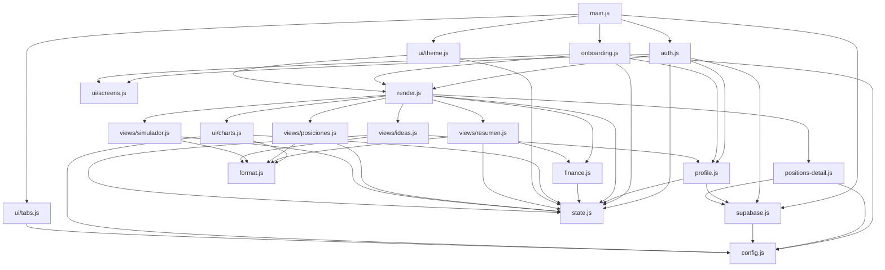

# Arquitectura

## En una frase

Una página estática que se autentica contra Supabase, se trae la última fila (minimizada, solo
agregados) de `portfolio_snapshots` del usuario logueado, pide el detalle por ticker aparte y al
momento cuando hace falta, y dibuja todo en cuatro pestañas. No hay servidor propio, no hay build,
no hay framework.

## Flujo de datos

**Sincronización diaria — lo único que se guarda, y son agregados:**

```
IBKR Flex Web Service
        │  (una vez por día, pg_cron, 10:00 UTC)
        ▼
sync-ibkr (Edge Function)  ──►  computeDerivedShape()  ──►  portfolio_snapshots.data
                                                              (JSONB minimizado, una fila por sync
                                                               — sin positions[]/trades[] crudos
                                                               desde el 2026-08-28, ver docs/DATOS.md)
                                       │
                                       │  select ... order by captured_at desc limit 1
                                       ▼
                             auth.js → setData(...) → state.js
                                       │
                                       ▼
                             render.js → views/* → DOM   (hero/tiles de Resumen ya se pueden pintar)
```

**Detalle por posición — a demanda, nunca se guarda:**

```
render.js → renderPositionsDependentSections()
                    │  (la primera vez que hace falta detalle por ticker en esta sesión
                    │   de navegador: Posiciones, Simulador, Ideas)
                    ▼
positions-detail.js → ensurePositionsDetail()
                    │  fetch, con el JWT del propio usuario
                    ▼
fetch-positions (Edge Function)  ──►  IBKR Flex Web Service (en el momento, no guarda nada)
                    │
                    │  devuelto en la respuesta HTTP, jamás escrito en una tabla
                    ▼
positions-detail.js  (cache en memoria de esa pestaña, nunca localStorage)
                    │
                    ▼
setPositionsDetail() → state.js (DATA.positions / DATA.trades) → renderPositionsDependentSections()
                                                                    se vuelve a llamar → dibuja
                                                                    Posiciones/Simulador/Ideas
```

La app **solo lee** de `portfolio_snapshots` y de `fetch-positions`. Nunca escribe en
`portfolio_snapshots`. Lo único que escribe es el perfil del inversor, en la tabla `profiles`
(ver `profile.js`), y `fetch-positions` no escribe en ninguna tabla en absoluto — por diseño (ver
`HANDOFF.md` para el porqué).

**Importante para no reintroducir el bug de privacidad que esto resolvió:** si algún día hace
falta más detalle por ticker en el snapshot diario (por ejemplo para recalcular `simulator` o
`allocation.sector`), la respuesta correcta no es volver a guardarlo en `sync-ibkr` — es ampliar
lo que calcula y devuelve `fetch-positions` on-demand, o agregar un agregado nuevo a
`computeDerivedShape()` que no exponga el detalle crudo. Ver los dos principios al principio de
`HANDOFF.md`.

## Mapa de módulos



**Nota (2026-08-28):** `positions-detail.js` es el único módulo que le habla directo a una Edge
Function por `fetch()` en vez de pasar por el cliente de Supabase para datos (sí usa `sb` para
sacar el JWT de la sesión). Es deliberado — ver `HANDOFF.md`.

**El grafo no tiene ciclos** y todos los módulos son alcanzables desde `main.js`.
Si agregás un módulo, mantené las dos propiedades.

## Qué hace cada módulo

| Módulo | Líneas | Responsabilidad |
|---|---:|---|
| `main.js` | 16 | Arranca. Si no hay cliente de Supabase, avisa en pantalla. |
| `supabase.js` | 13 | Crea el cliente. Aislado para que nadie más dependa del arranque. |
| `config.js` | 19 | Constantes: URL y key de Supabase, pestañas, paleta, mapa de instrumentos. |
| `state.js` | 18 | `DATA` y el id de usuario. **Se mutan solo desde acá**, vía `setData` / `setCurrentUserId`. |
| `format.js` | 25 | `fmtUSD`, `fmtPct`, `deltaClass`, etc. Sin lógica de negocio. |
| `finance.js` | 105 | ⚠ Las cinco funciones auditadas. Ver `AUDITORIA.md`. |
| `auth.js` | 135 | Login, registro, y la carga del snapshot desde Supabase. |
| `profile.js` | 42 | Lee, guarda y aplica el perfil de inversor (tabla `profiles`). |
| `onboarding.js` | 51 | Pantalla de bienvenida. Solo efectos: registra sus listeners al importarse. |
| `render.js` | 27 | El orquestador. **Si querés saber qué se dibuja, empezá acá.** |
| `positions-detail.js` | 30 | Pide el detalle por ticker a `fetch-positions` on-demand, cachea en memoria (nunca disco). Nuevo 2026-08-28. |
| `ui/theme.js` | 38 | Claro / oscuro / sistema, persistido en `localStorage`. |
| `ui/tabs.js` | 23 | Pestañas y deep-link por `#hash`. |
| `ui/screens.js` | 21 | Alterna entre login, onboarding y app. |
| `ui/charts.js` | 112 | SVG a mano: línea de rendimiento y barras. Sin librerías. |
| `views/resumen.js` | 50 | Hero y tiles. |
| `views/posiciones.js` | 40 | Tabla de tenencias y de operaciones. |
| `views/simulador.js` | 198 | Ganancia real (exacta) + comparación contra benchmarks (parcial). |
| `views/ideas.js` | 140 | Perfil inferido, ajustes sugeridos y quiz. |

Total: **1.073 líneas de JS** repartidas en 18 archivos, más 390 de CSS y 386 de markup.
Antes de este refactor era **un solo archivo de 1.689 líneas**.

## Convenciones

**Estado mutable.** `export let DATA` da un binding vivo: quien importa `DATA` ve siempre el
valor actual. Pero reasignarlo solo se puede desde su propio módulo — por eso existen
`setData()` y `setCurrentUserId()`. No agregues estado mutable fuera de `state.js`.

**Módulos de solo efecto.** `onboarding.js`, `ui/theme.js` y `ui/tabs.js` no exportan nada útil:
registran sus listeners al importarse. `main.js` los importa explícitamente por eso. Si alguna
vez desaparecen esos imports, la app carga pero el tema, las pestañas y el onboarding dejan de
responder, **sin ningún error en consola**. Es la clase de bug más difícil de encontrar acá.

**Nada de handlers inline.** Cero `onclick=` en el markup: con módulos ES no funcionarían,
porque las funciones ya no son globales.

**El orden importa en `render.js`.** `markStaleAllocation()` y `markPerfAsOf()` se llaman
*después* de dibujar, porque marcan lo ya dibujado como desactualizado.

## Por qué módulos ES y no un bundler

La app no tiene dependencias más allá del cliente de Supabase por CDN. Un bundler agregaría un
paso de build que se puede romper, un `node_modules`, y una diferencia entre "lo que está en el
repo" y "lo que corre". Los módulos nativos dan lo que hacía falta — dependencias explícitas y
nada de variables globales — a costo cero.

El precio: **no se puede abrir `index.html` con doble clic**. Hay que servirlo por HTTP
(ver README). Si algún día eso molesta más de lo que ayuda, la salida es volver a scripts
clásicos, no meter un bundler.
